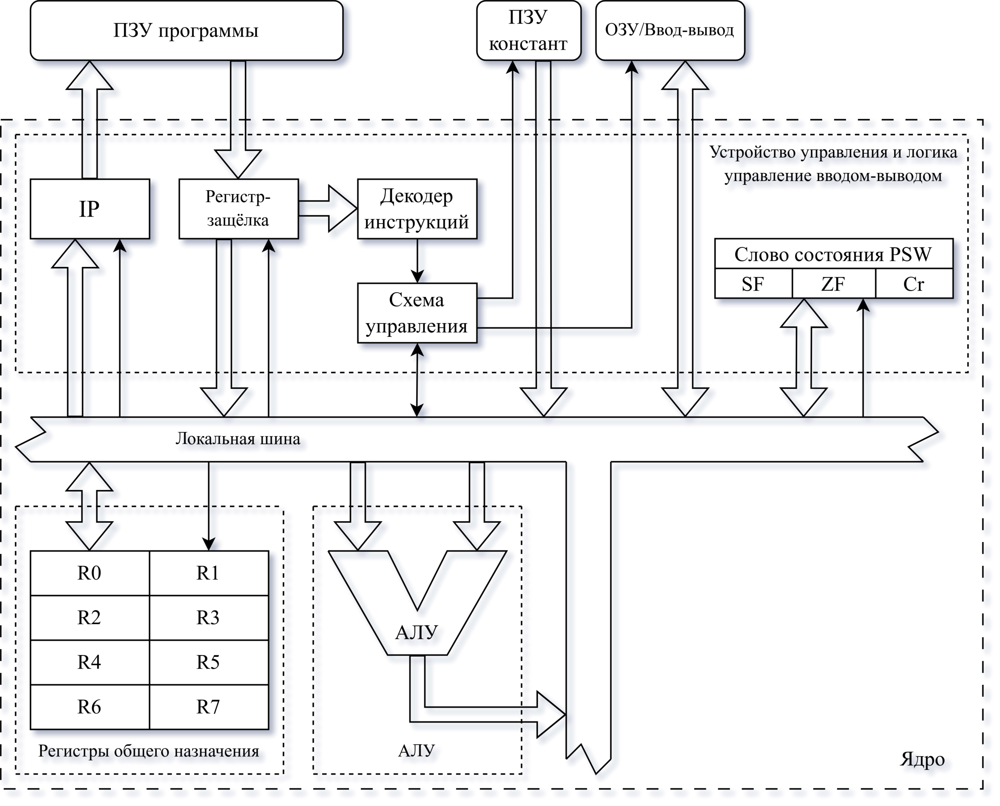
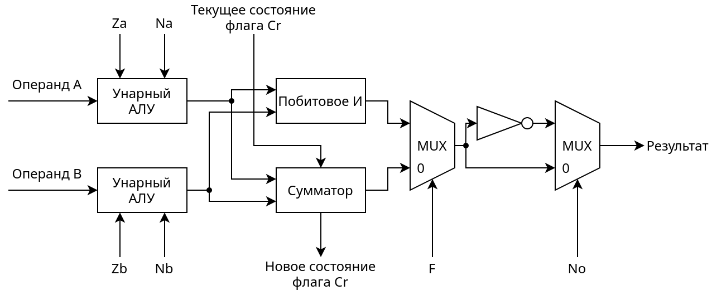

# R8N3 (RU)

Ядро 8-битного RISC процессора с гарвардской архитектурой.

## Микроархитектура

Ядро процессора включает в себя 8 регистров общего назначения, регистр специального назначения (IP), регистр флагов состояния ядра, АЛУ, логику управления вводом-выводом и устройство управления.

### 1. Регистры общего назначения

Регистры общего назначения предназначены не только для хранения данных, но и имеют специальное назначения при определённых операциях. Все регистры общего назначения имеют размер равный 8 бит.

| Регистр |                   Специальное назначение                  |
|:-------:|:---------------------------------------------------------:|
|    R0   | Первый операнд АЛУ                                        |
|    R1   | Промежуточный регистр при копировании и загрузке констант |
|    R2   | Адрес условного прыжка                                    |
|    R3   | Адрес безусловного прыжка                                 |
|    R4   | Адрес записи в ОЗУ/Порт                                   |
|    R5   | Адрес чтения из ОЗУ/Порта                                 |
|    R6   | Адрес чтения из ПЗУ констант                              |
|    R7   | Без специального назначения                               |

Также над регистрами могут выполняться математические операции и операция сравнения с нулём.

### 2. Регистр флагов

Регистр флагов, он же регистр битов состояния, хранит состояние после последней операцией над числом, по типу получения данных из порта, работа с АЛУ и расчёт прыжков.

|   |   |   |   |   | SF | ZF | Cr |
|:-:|:-:|:-:|:-:|:-:|:--:|:--:|:--:|

| Обозначение |              Назначение             |
|:-----------:|:-----------------------------------:|
|      SF     | Значение старшего бита (знак числа) |
|      ZF     | Число равно нулю                    |
|      Cr     | Заём или переполнение бита переноса |

Регистр состояния используется для реализации условного перехода, расчёта больших переменных (больше машинного слова) используя бит переноса и управление ветвлением (прыжками) программы.

| Код условия перехода | Условие состояния флагов |         Условие        |
|:--------------------:|:------------------------:|:----------------------:|
|          000         | ZF = 0                   | Не равно нулю          |
|          001         | ZF = 1                   | Равно нулю             |
|          010         | SF = 0                   | Больше или равно нулю  |
|          011         | SF = 0 и ZF = 0          | Больше нуля            |
|          100         | SF = 1                   | Меньше или равно нулю  |
|          101         | SF = 1 и ZF = 0          | Меньше нуля            |
|          110         | Cr = 0                   | Нет заёма/переполнения |
|          111         | Cr = 1                   | Заём или переполнение  |

### 3. Регистры специального назначения

Регистры специального назначения скрыты от прямого использования программистом и нужны ядру для контроля потока выполнения.

В данном ядре используется два регистра специального назначения: ранее описанный регистр флагов и регистр IP (Instruction Pointer - указатель инструкции). Регистр IP инкрементируется после каждой выполненной инструкции, а при прямом прыжке в IP записывается адрес из регистра.

Также в ядре используются регистры-защёкли. Они нужны для хранения данных между тактами синхронизации чтобы избежать состояния гонки и нарушения работы ядра.

### 4. АЛУ

Арифметико-Логическое Устройство необходимо для выполнения арифметических и логических операций над данными, в нашем случае над регистром R0 и регистром определённом в инструкции. Результат сохраняется в том же определённом инструкцией регистре. Также АЛУ может работать в унарном режиме выполняя операцию над одним операндом. Этим операндом выступает регистр общего назначения. Во время работы АЛУ изменяет флаги SF, ZF и Cr в соответствии с выполняемой операцией.

| Код Операции АЛУ |  Операция  |               Описание               |
|:----------------:|:----------:|:------------------------------------:|
|        000       | A + B + Cr | Сложение с битом переноса            |
|        001       |   A & B    | Побитовое И                          |
|        010       | A - B - Cr | Вычитание с битом переноса           |
|        011       |   A \| B   | Побитовое ИЛИ                        |
|        100       | B - 1 + Cr | Декремент с битом переноса           |
|        101       | B + 1 - Cr | Инкремент с битом переноса           |
|        110       |   ~B + Cr  | Побитовая инверсия с битом переноса  |
|        111       |      B     | Необходимо для операции сравнения    |

Как можно заметить по коду операции АЛУ, операции над двумя операндами имеют код вида 0XX, а унарные операции код вида 1ХХ. Такое распределение операций обусловлено оптимизацией кодирования состояния используемого в схеме АЛУ.

Унарный АЛУ выполняет две простых операции:

1. Обнуление входного операнда (сигнал Za и Zb)
2. Инверсия операнда (сигнал Na и Nb)

Таблица истинности УАЛУ имеет следующий вид

| Zx | Nx | Состояние выхода УАЛУ (x, Zx, Nx) |
|:--:|:--:|:---------------------------------:|
|  0 |  0 |                 x                 |
|  0 |  1 |                 ~x                |
|  1 |  0 |                 0                 |
|  1 |  1 |                 ~0                |

Для оптимизации инструкций АЛУ были выделены основные необходимые операции и закодированы в следующие коды:

| Код Операции АЛУ | F | Za | Na | Zb | Nb | No |      Операция      |
|:----------------:|:-:|:--:|:--:|:--:|:--:|:--:|:------------------:|
|        000       | 0 |  0 |  0 |  0 |  0 |  0 |     A + B + Cr     |
|        001       | 1 |  0 |  0 |  0 |  0 |  0 |       A & B        |
|        010       | 0 |  0 |  1 |  0 |  0 |  1 |     A - B - Cr     |
|        011       | 1 |  0 |  1 |  0 |  1 |  1 |       A \| B       |
|        100       | 0 |  1 |  1 |  0 |  0 |  0 |     B - 1 + Cr     |
|        101       | 0 |  1 |  1 |  0 |  1 |  1 |     B + 1 - Cr     |
|        110       | 0 |  1 |  0 |  0 |  1 |  0 |       ~B + Cr      |
|        111       | 1 |  1 |  1 |  0 |  0 |  0 | B (не сохраняется) |

Из таблицы видно, что Zb не используется, но он полезен при выполнении нереализованной операции B - A - Cr, а также замены операнда A на B в операциях инкремента, декремента. Операция с опкодом 111 используется только для сравнения с нулём и обновлением флагов, результат игнорируется.

### 5. Логика управления вводом-выводом

Логику управления вводом-выводом контролирует работу с памятью и устройствами, доступные ядру. Так как используется Гарвардская архитектура, то память программы и память данных разделены, но в нашем случае ПЗУ устроена чуть иначе:

* ПЗУ программы - хранит код программы и доступна только устройству управления через регистр IP.
* ПЗУ констант - доступна по адресу из регистра R6 и из специального опкода.

ОЗУ разделяет одно адресное пространство с портами доступное через регистры R4 и R5. Это сделано из-за недостатка размера опкодов и в угоду упрощения ядра.

### 6. Устройство управления

Устройство управления состоит из декодера инструкций, специальных регистров (IP, PSW) и связующей логики. Благодаря нему определяется текущее состояние процессора и последующие действия, такие как управление АЛУ или контроль ветвления. Поведение устройства управления в свою очередь определяется декодером инструкций. Декодер определяет 26 инструкций:

<!--- Лень писать вручную. Нагенерировал тут HTML ;) -->
<table><thead><tr><th>Мнемокод</th><th colspan="8">Опкод</th><th>Описание</th></tr></thead><tbody><tr><td>mov r1, index</td><td>0</td><td colspan="7">index</td><td>Копирует значение из ПЗУ констант по адресу index в регистр R1 </td></tr><tr><td>add r0, r</td><td>1</td><td>0</td><td>0</td><td>0</td><td>0</td><td colspan="3">R</td><td>R = R0 + R1 + Cr</td></tr><tr><td>and r0, r</td><td>1</td><td>0</td><td>0</td><td>0</td><td>1</td><td colspan="3">R</td><td>R = R0 &amp; R</td></tr><tr><td>sub r0, r</td><td>1</td><td>0</td><td>0</td><td>1</td><td>0</td><td colspan="3">R</td><td>R = R0 – R – Cr</td></tr><tr><td>or r0, r</td><td>1</td><td>0</td><td>0</td><td>1</td><td>1</td><td colspan="3">R</td><td>R = R0 | R</td></tr><tr><td>dec r</td><td>1</td><td>0</td><td>1</td><td>0</td><td>0</td><td colspan="3">R</td><td>R = R - 1 + Cr</td></tr><tr><td>inc r</td><td>1</td><td>0</td><td>1</td><td>0</td><td>1</td><td colspan="3">R</td><td>R = R + 1 - Cr</td></tr><tr><td>not r</td><td>1</td><td>0</td><td>1</td><td>1</td><td>0</td><td colspan="3">R</td><td>R = ~R + Cr</td></tr><tr><td>test r</td><td>1</td><td>0</td><td>1</td><td>1</td><td>1</td><td colspan="3">R</td><td>Сравнение R с нулём</td></tr><tr><td>mov r1, r</td><td>1</td><td>1</td><td>0</td><td>0</td><td>0</td><td colspan="3">Src</td><td>R1 = Src</td></tr><tr><td>mov r, r1</td><td>1</td><td>1</td><td>0</td><td>0</td><td>1</td><td colspan="3">Dest</td><td>Dest = R1</td></tr><tr><td>str r</td><td>1</td><td>1</td><td>0</td><td>1</td><td>0</td><td colspan="3">Src</td><td>Передача Src в ОЗУ/Порт по адресу из R4</td></tr><tr><td>ldr r</td><td>1</td><td>1</td><td>0</td><td>1</td><td>1</td><td colspan="3">Dest</td><td>Чтение из ОЗУ/Порта по адресу из R5 в Dest</td></tr><tr><td>ldcr r</td><td>1</td><td>1</td><td>1</td><td>0</td><td>0</td><td colspan="3">Dest</td><td>Чтение из ПЗУ констант по адресу из R6 в Dest</td></tr><tr><td>jne</td><td>1</td><td>1</td><td>1</td><td>0</td><td>1</td><td>0</td><td>0</td><td>0</td><td>Прыжок если не равно</td></tr><tr><td>je</td><td>1</td><td>1</td><td>1</td><td>0</td><td>1</td><td>0</td><td>0</td><td>1</td><td>Прыжок если равно</td></tr><tr><td>jge</td><td>1</td><td>1</td><td>1</td><td>0</td><td>1</td><td>0</td><td>1</td><td>0</td><td>Прыжок если больше или равно</td></tr><tr><td>jg</td><td>1</td><td>1</td><td>1</td><td>0</td><td>1</td><td>0</td><td>1</td><td>1</td><td>Прыжок если больше</td></tr><tr><td>jle</td><td>1</td><td>1</td><td>1</td><td>0</td><td>1</td><td>1</td><td>0</td><td>0</td><td>Прыжок если меньше или равно</td></tr><tr><td>jl</td><td>1</td><td>1</td><td>1</td><td>0</td><td>1</td><td>1</td><td>0</td><td>1</td><td>Прыжок если меньше</td></tr><tr><td>jnc</td><td>1</td><td>1</td><td>1</td><td>0</td><td>1</td><td>1</td><td>1</td><td>0</td><td>Прыжок если нет заёма/переноса</td></tr><tr><td>jc</td><td>1</td><td>1</td><td>1</td><td>0</td><td>1</td><td>1</td><td>1</td><td>1</td><td>Прыжок если есть заём/перенос</td></tr><tr><td>jmp</td><td>1</td><td>1</td><td>1</td><td>1</td><td>0</td><td>0</td><td>0</td><td>0</td><td>Прыжок по адресу из R3</td></tr><tr><td>hlt</td><td>1</td><td>1</td><td>1</td><td>1</td><td>0</td><td>0</td><td>0</td><td>1</td><td>Остановка ядра</td></tr><tr><td>clc</td><td>1</td><td>1</td><td>1</td><td>1</td><td>0</td><td>0</td><td>1</td><td>0</td><td>Сброс Cr в 0</td></tr><tr><td>stc</td><td>1</td><td>1</td><td>1</td><td>1</td><td>0</td><td>0</td><td>1</td><td>1</td><td>Установка Cr в 1</td></tr></tbody></table>

Как можно заметить остались ещё неиспользуемые опкоды. Это сделано для возможности модифицирования набора команд без изменения основного списка.

Из модификаций можно выделить добавление операций умножения и деления, а также реализация системы прерываний.

## Заключение

Это `README.md`. Какое заключение?
